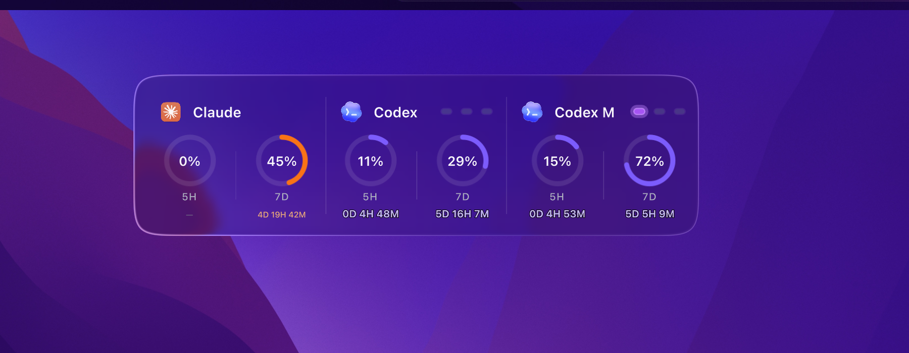
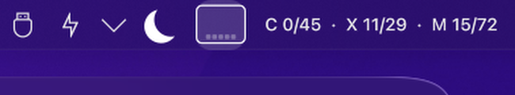
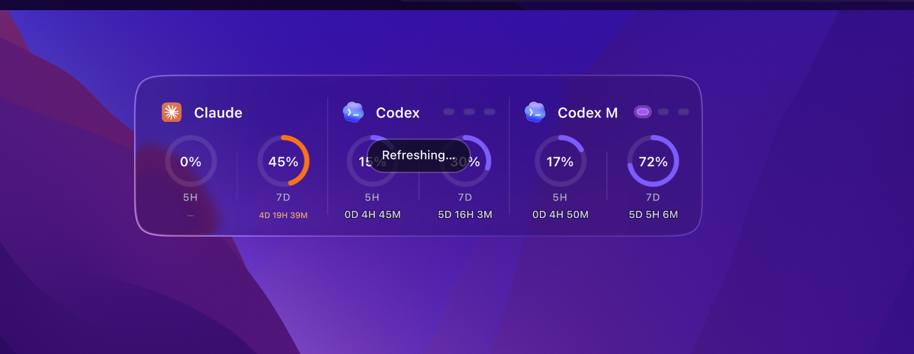
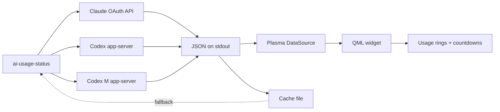

# AI Usage for KDE Plasma 6

[](LICENSE)

[](https://github.com/kofdarelli/ai-usage-plasmoid/actions/workflows/ci.yml)
[](https://github.com/kofdarelli/ai-usage-plasmoid/releases/latest)
[](https://store.kde.org/p/2369842/)

**A translucent Liquid Glass desktop widget that shows live Claude Code and Codex usage limits with reset countdowns.**

## Highlights

- **Usage rings** -- real-time percentage of the current 5-hour / 7-day / custom window consumed per service.
- **Multi-account Codex support** -- track two separate Codex accounts (e.g. personal + work) side by side as distinct "Codex" and "Codex M" cards.
- **Reset countdowns** -- live countdown to the next window reset, derived from the API response.
- **Reset badges** -- Codex shows available/used quota resets as purple glowing dots.
- **Defensive parsing** -- normalizes upstream field names so the widget survives Codex and Claude API changes without a re-release.
- **Offline fallback** -- caches last-good data so the widget still shows useful information when a service is temporarily unreachable.
- **Click-to-refresh** -- tap any card to force an immediate usage update and re-capture the desktop background.

## Screenshots

| Full glass panel | Compact panel representation |
| --- | --- |
|  |  |

| Click-to-refresh |
| --- |
|  |

## Architecture



| Layer | Implementation |
| --- | --- |
| Interface | QML with Liquid Glass frosted-glass shader |
| Data collection | Node.js helper (`ai-usage-status`) using built-in `fetch` |
| Claude | OAuth token from `~/.claude/.credentials.json`, REST to `api.anthropic.com` |
| Codex | Local stdio protocol (`codex app-server --stdio`) |
| Persistence | JSON cache at `~/.cache/ai-usage-status.json` (0600 perms) |
| Build | `cmake -E tar` to produce a `.plasmoid` zip |

## Requirements

| Requirement | Details |
| --- | --- |
| **KDE Plasma 6** | Works on Wayland and X11 |
| **Node.js 18+** | The bundled helper uses the built-in `fetch` API |
| **Claude Code** | Signed in so `~/.claude/.credentials.json` exists |
| **Codex CLI** | Installed and signed in (`codex` on your PATH) |
| **Network** | Claude usage from `api.anthropic.com`; Codex from local app-server |

No credentials are bundled with the widget. The helper reads them locally and only sends the Claude OAuth token to Anthropic's API.

## Installation

**From the KDE Store (recommended):** right-click your desktop, choose **Add Widgets** > **Get New Widgets...**, and search for **AI Usage** -- or install directly from the [KDE Store listing](https://store.kde.org/p/2369842/). Then drag it onto your desktop.

**Manual install:** download the `.plasmoid` file from the [latest release](https://github.com/kofdarelli/ai-usage-plasmoid/releases/latest) and install:

```sh
kpackagetool6 --type Plasma/Applet --install ai-usage-1.0.0.plasmoid
```

For upgrades, replace `--install` with `--upgrade`.

Then right-click your desktop, choose **Add Widgets**, and search for **AI Usage**. Drag it onto your desktop.

> **Placement tip:** Place the widget directly on the desktop for the liquid glass effect. Panels have no wallpaper scene, so the glass falls back to a dark translucent squircle.

## Setup

### Claude Code

Sign in to Claude Code if you haven't already:

```sh
claude
```

The widget reads your OAuth token from `~/.claude/.credentials.json`. For a custom path, set `AI_USAGE_CLAUDE_CREDENTIALS`.

### Codex CLI

Sign in to the Codex CLI:

```sh
codex auth login
```

The widget communicates with the Codex app-server over stdio to read rate limits. No network calls are made -- everything stays local.

### Optional: Second Codex account (Codex M)

The widget supports two separate Codex accounts at once, useful if you split personal and work usage across two logins. Sign in to your second account under an isolated `CODEX_HOME` (e.g. `codex --codex-home ~/.codex-codexm auth login`), and the widget shows a third **Codex M** card automatically when `~/.codex-codexm/auth.json` exists. Point it at a different location with `AI_USAGE_CODEX_SECONDARY_HOME` / `AI_USAGE_CODEX_SECONDARY_CONFIG_HOME` if needed.

## Configuration

The widget works out of the box. Override defaults with environment variables before starting Plasma (e.g. in `~/.config/environment.d/`):

| Variable | Default | Purpose |
| --- | --- | --- |
| `AI_USAGE_CLAUDE_CREDENTIALS` | `~/.claude/.credentials.json` | Path to Claude OAuth credentials |
| `AI_USAGE_CODEX_BIN` | `codex` | Path to the Codex CLI binary |
| `AI_USAGE_CODEX_HOME` | `~/.codex` | Primary Codex profile directory |
| `AI_USAGE_CODEX_SECONDARY_HOME` | `~/.codex-codexm` | Secondary Codex profile directory |
| `AI_USAGE_CODEX_SECONDARY_CONFIG_HOME` | `~/.config-codexm` | Secondary Codex config directory |

## How it works

1. Every 5 minutes (or on click), Plasma runs the `ai-usage-status` helper.
2. The helper reads Claude credentials and calls the Anthropic usage API.
3. The helper spawns `codex app-server --stdio` and reads rate limits over the local JSON protocol.
4. Results are written to stdout as JSON and cached to `~/.cache/ai-usage-status.json`.
5. The QML widget parses the JSON and updates the rings and countdowns.

If a service is unreachable or its API shape changes, the widget degrades gracefully:
- **Last-good cache** -- previously successful data is shown with a stale indicator
- **Fallback labels** -- window labels are derived from remaining time, not hardcoded
- **Dash display** -- if no data is available at all, rings show a dash instead of a misleading "0%"

## Troubleshooting

**Widget shows dashes for everything**
- Check Claude Code: `cat ~/.claude/.credentials.json | head -5`
- Check Codex: `codex auth status`
- Check Node.js: `node --version` (must be 18+)

**Widget shows stale data**
- Click any card to force an immediate usage update and re-capture the background
- Check the cache: `cat ~/.cache/ai-usage-status.json | python3 -m json.tool`

**Glass effect not working**
- Place the widget on the desktop, not in a panel (panels have no wallpaper scene)

**Codex M card not appearing**
- The secondary profile must exist at `~/.codex-codexm/auth.json`

## Privacy

- Credentials never leave your machine (Claude token is sent only to `api.anthropic.com`)
- Codex usage is read over a local stdio process -- no network calls
- Cache file is created with `0600` permissions (owner-only)
- No telemetry, analytics, or phone-home

## Important components

- `package/contents/tools/ai-usage-status` -- Node.js helper that collects Claude and Codex usage data.
- `package/contents/ui/main.qml` -- QML widget with service cards, usage rings, and countdowns.
- `package/contents/ui/components/LiquidGlass.qml` -- Frosted-glass shader derived from [macOS Widgets](https://github.com/jaxparrow07/macos-widgets).
- `package/contents/ui/components/MacOSColors.qml` -- Dark/light palette used by the glass tint.

## Project layout

```text
package/
├── contents/
│   ├── images/
│   │   ├── claude.png
│   │   └── codex.png
│   ├── tools/
│   │   └── ai-usage-status       Node.js data helper
│   └── ui/
│       ├── components/
│       │   ├── LiquidGlass.qml
│       │   ├── MacOSColors.qml
│       │   └── shaders/
│       │       ├── crop.frag(.qsb)
│       │       ├── kawase_down.frag(.qsb)
│       │       ├── kawase_up.frag(.qsb)
│       │       ├── blur_h.frag(.qsb)
│       │       ├── blur_v.frag(.qsb)
│       │       └── liquidglass.frag(.qsb)
│       └── main.qml
├── metadata.json
build.sh
LICENSE
README.md
```

## Verification

Build the package:

```sh
./build.sh
```

The `.plasmoid` file is written to `dist/`.

Install and restart the desktop:

```sh
kpackagetool6 --type Plasma/Applet --upgrade dist/ai-usage-1.0.0.plasmoid
systemctl --user restart plasma-plasmashell
```

Check for errors:

```sh
journalctl --user -u plasma-plasmashell --since "5 min ago" | grep -i "aiusage\|ai-usage"
```

No errors should appear. The widget should render with a frosted glass panel showing usage rings for each configured service.

## Compatibility

The widget reads data from:
- **Anthropic's Claude Code OAuth usage endpoint** (`api.anthropic.com/api/oauth/usage`)
- **Codex CLI's app-server rate-limits interface** (local stdio protocol)

These interfaces may change in future versions. The helper uses defensive field normalization (multiple known aliases per field) to tolerate minor API changes without breaking. If a major API change occurs, a helper update may be needed.

## Contributing and security

Read [CONTRIBUTING.md](CONTRIBUTING.md) before opening a pull request. Report vulnerabilities privately through [SECURITY.md](SECURITY.md).

## Credits and license

The Liquid Glass QML component and shaders are derived from [macOS Widgets](https://github.com/jaxparrow07/macos-widgets) by Jack Faith. See [THIRD_PARTY_NOTICES.md](THIRD_PARTY_NOTICES.md) for bundled component licenses.

The included Claude and Codex product marks belong to their respective owners and are used only to identify the services. This project is not affiliated with Anthropic or OpenAI.

Licensed under the [GNU General Public License v3.0 only](LICENSE).
